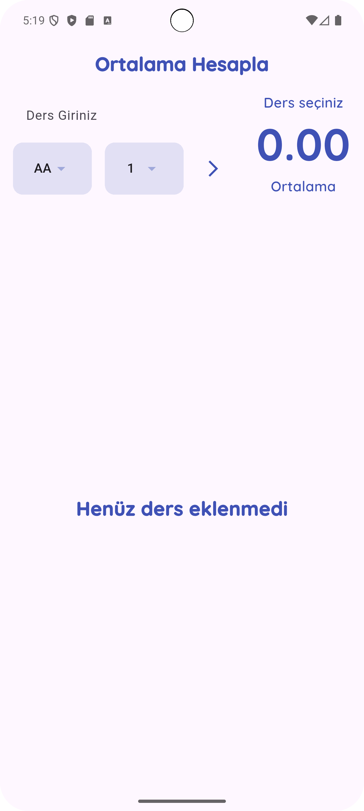
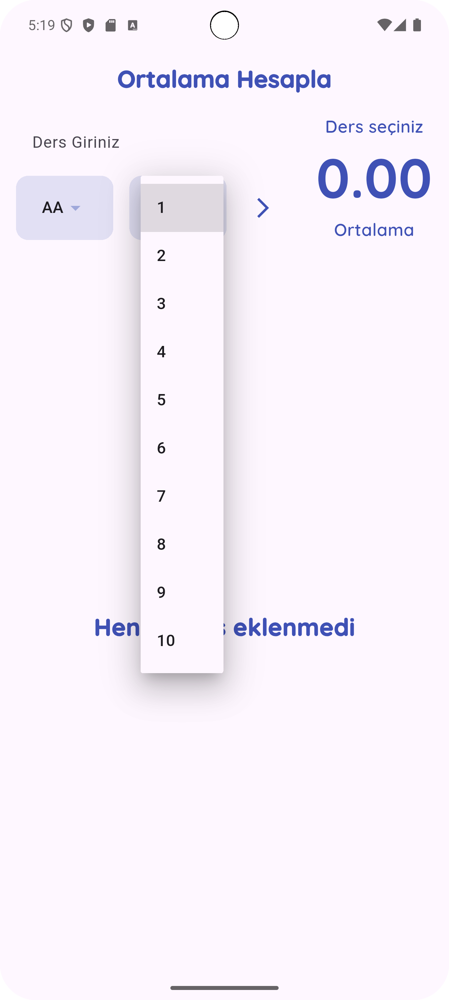
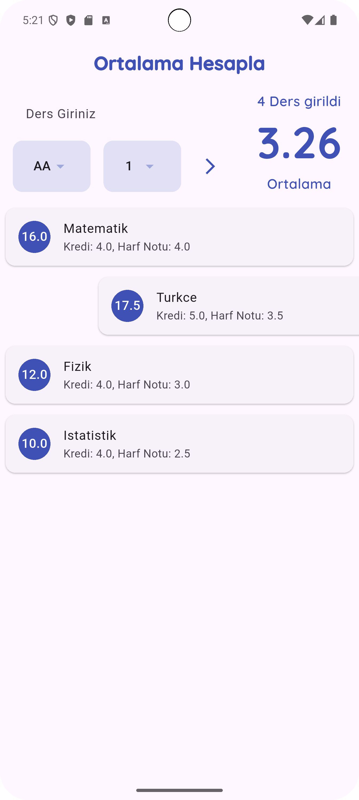
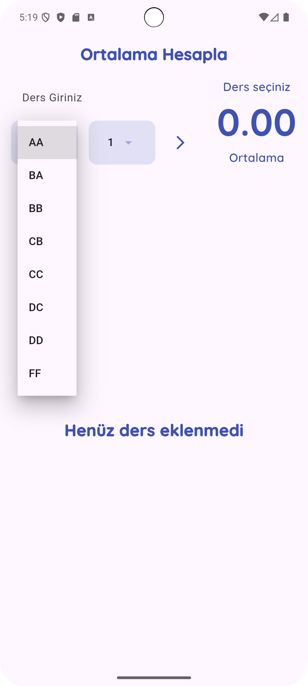
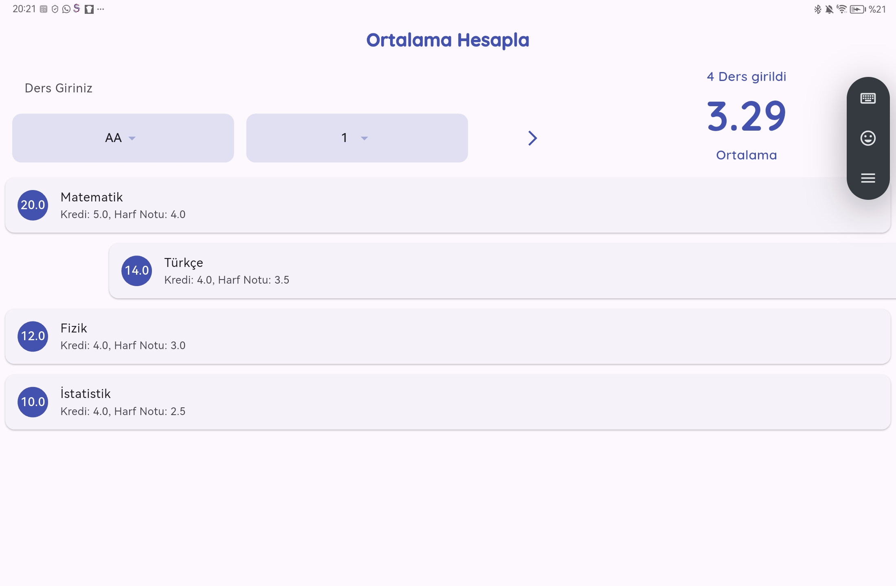
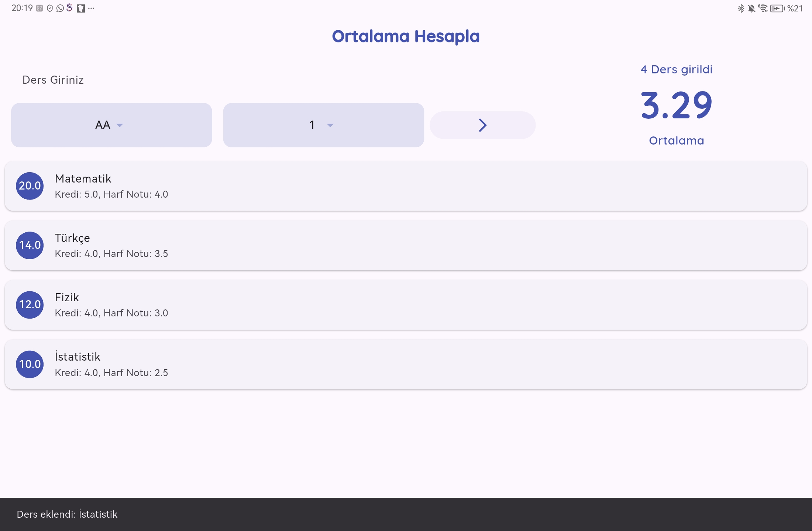
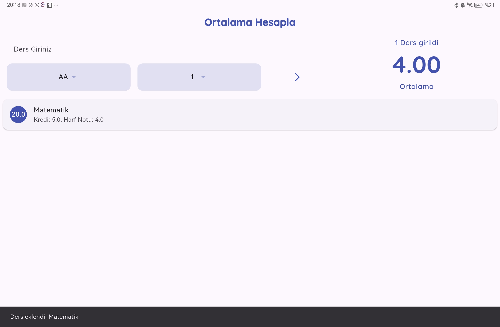
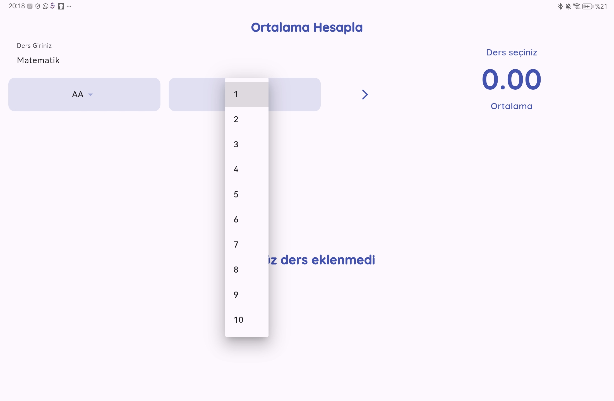
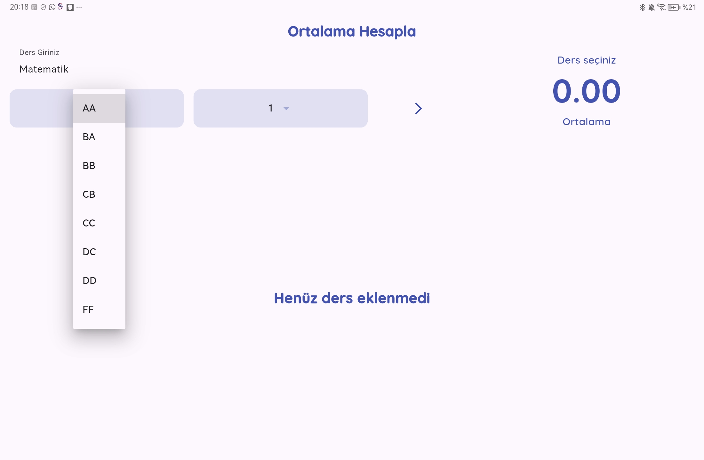
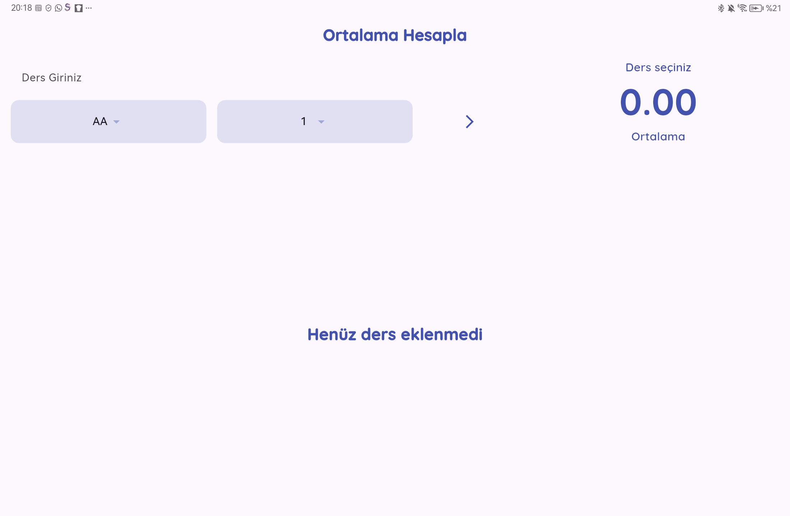

# GANO Calculator (Flutter)
[🇹🇷 Türkçe](README.tr.md)

A simple, offline **GPA (GANO)** calculator for university students. Pick a letter grade (AA–FF), set credits, add courses, and see your **credit-weighted** GPA instantly.

## Features
- Letter → point mapping *(AA=4.0 … FF=0.0)*
- **Credit-weighted** GPA calculation
- Add/remove courses, total credits & course count
- Phone & tablet friendly UI, **offline**
- Optional: Dark theme & dynamic color (Android 12+)

## Screenshots

  
  
  
  
  
  
  
  
  
  

## Getting Started
Bash
flutter pub get
flutter run
