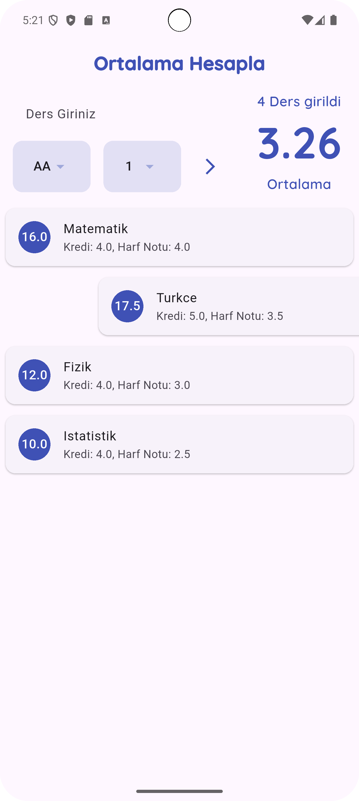
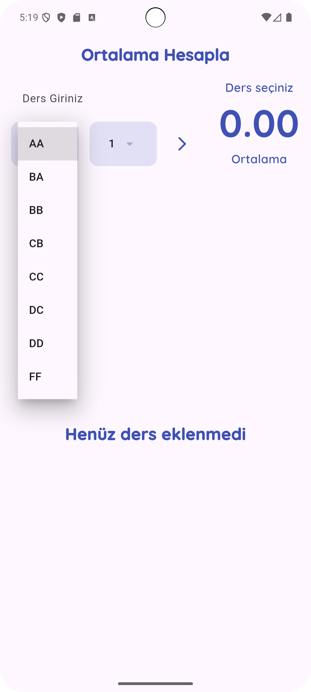
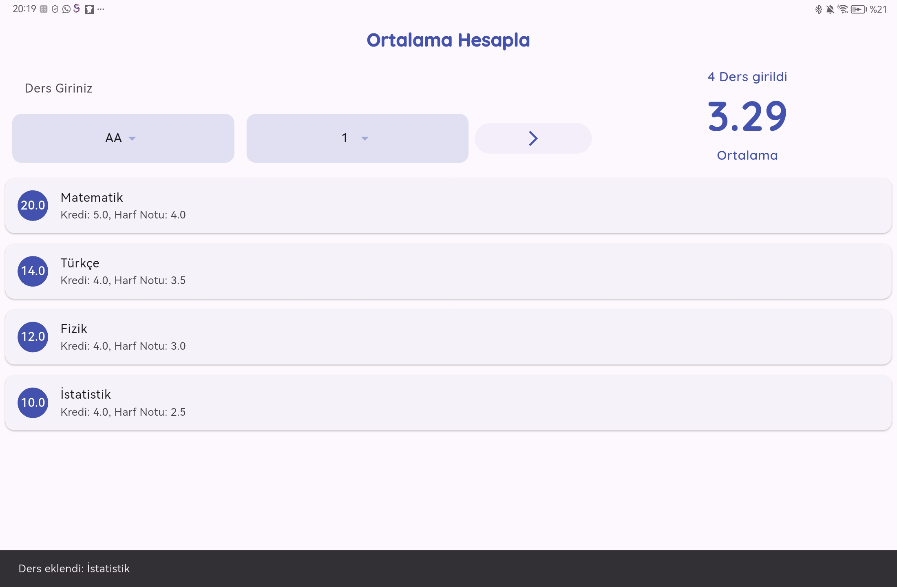
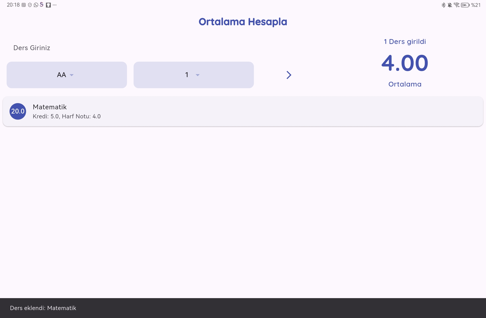

# GANO Hesaplayıcı (Flutter)
[🇬🇧 English](README.md)

Üniversite öğrencileri için **çevrimdışı** GANO/GPA hesaplayıcı. Harf notu (AA–FF) ve kredi gir, dersi ekle; **kredi ağırlıklı** ortalamayı anında gör.

## Özellikler
- Harf → katsayı (AA=4.0 … FF=0.0)
- Kredi ağırlıklı ortalama
- Ders ekle/sil, toplam kredi & ders sayısı
- Telefon/tablet uyumlu, **offline**
- (Opsiyonel) Koyu tema & dinamik renk (Android 12+)

## Ekran Görüntüleri

  
  
  
  
  
  
  
  
  
  

## Başlangıç
`ash
flutter pub get
flutter run
