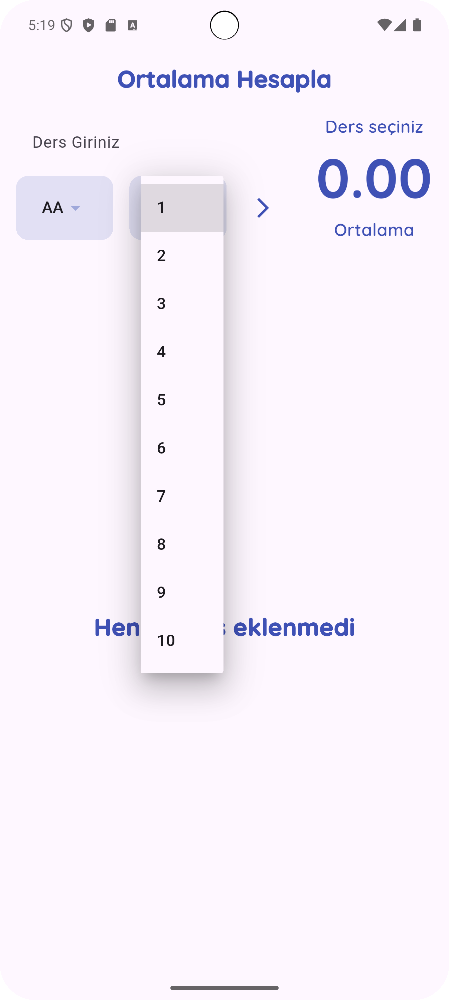
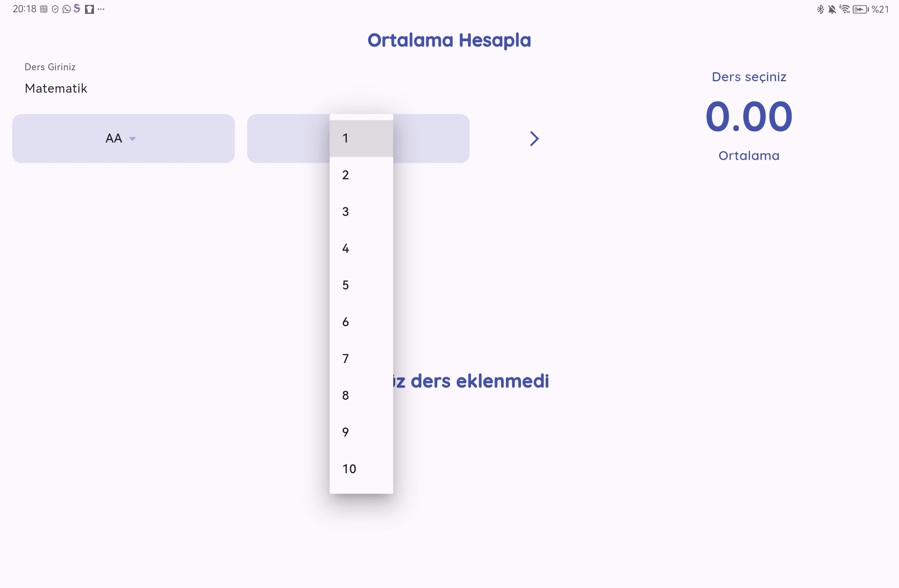

# GANO Hesaplayıcı
[English README](README.md)


Bu proje, üniversite öğrencilerinin Genel Ağırlıklı Not Ortalamasını (GANO) kolayca hesaplayabilmesi için geliştirilmiş mobil bir uygulamadır.

## 📱 Özellikler
- Ders adı, kredi ve not girerek kolayca hesaplama yapma  
- Tüm derslerinizi listeleyebilme
- Sağa kaydırarak ders silebilme  
- GANO sonucunu otomatik hesaplama  
- Kullanıcı dostu arayüz  
- Mobil cihazlarda hızlı ve basit kullanım

## Yol Haritası
- Koyu Mod eklenecek
- İngilizce dil desteği eklenecek
  

## Ekran Görüntüleri
<p align="center">
  
  
  
  
  
  
  
  
  
  
</p>


## 🚀 Kurulum
1. Bu projeyi GitHub'dan klonlayın:  
   ```bash
   git clone https://github.com/aliozdeemir/gano-hesaplayici.git
   ```
2. Projeyi **Android Studio** veya **VS Code** ile açın.  
3. Gerekli bağımlılıkları yüklemek için:  
   ```bash
   flutter pub get
   ```
4. Uygulamayı çalıştırmak için:  
   ```bash
   flutter run
   ```

## 📂 Dosya Yapısı
- `lib/` → Uygulamanın ana kodları  
- `pubspec.yaml` → Paket bağımlılıkları  
- `android/` ve `ios/` → Platforma özgü dosyalar  

## Kullanılan Paketler
- [google_fonts](https://pub.dev/packages/google_fonts): Google Fonts desteği ile özel yazı tipleri kullanabilmeyi sağlar.  
- [path_provider](https://pub.dev/packages/path_provider): Google Fonts paketi tarafından kullanılan dosya yolu erişimi için gereklidir.  


## 🤝 Katkıda Bulunma
Katkı sağlamak için:  
1. Bu depoyu forklayın  
2. Yeni bir branch açın (`feature/yenilik`)  
3. Değişikliklerinizi commit edin  
4. Pull request gönderin  

## 📜 Lisans
Bu proje [MIT Lisansı](LICENSE) ile lisanslanmıştır.

## 📬 İletişim
[](mailto:aoz.demir@outlook.com)
[](https://github.com/aliozdeemir)

